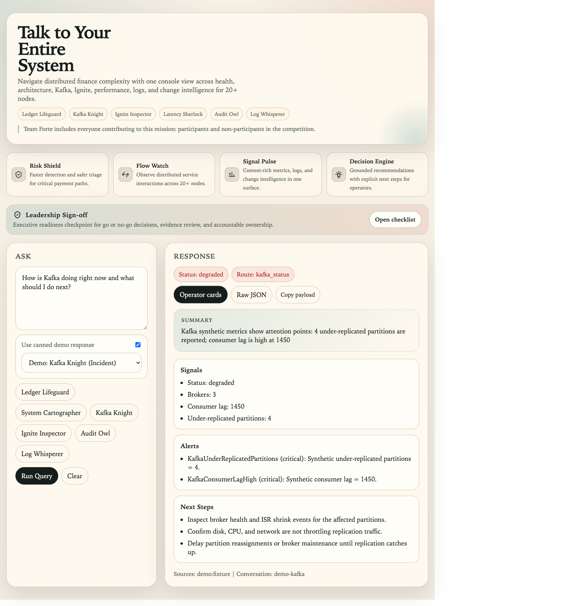
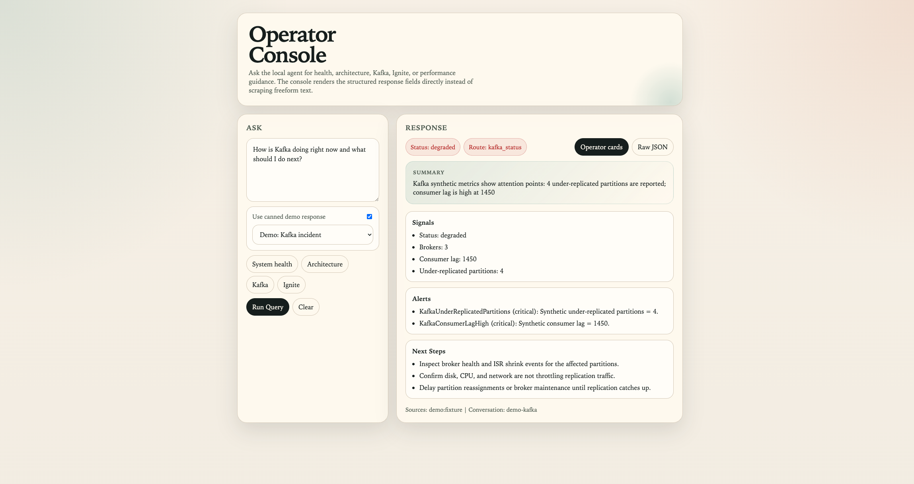

# AIEverywhere

[](https://github.com/shuklaaks81/AIEverywhere/actions/workflows/snapshot-tests.yml)

Day 1 monorepo scaffold for a local observability and agent demo stack.

Positioning theme: Talk to your entire system.

Team Forte statement: Team Forte includes everyone helping this effort, both participants and non-participants in the competition.

## Quick Access

- Operator console: http://localhost:8000/console
- Grafana: http://localhost:3000
- Prometheus: http://localhost:9090

If you just want to explore the Day 7 operator UX, open the operator console first. It renders the structured `sections`, `alerts`, and `next_steps` fields directly and now includes a raw JSON mode for payload inspection.

## Concept to Production (Finance, 20+ Nodes)

Detailed production rollout recommendation is available at `docs/production-go-live-plan.md`.

Leadership one-page sign-off checklist is available at `docs/executive-go-live-checklist.md`.

Highlights:

1. Freeze risk scope and critical finance journeys.
2. Design a 20+ node HA topology with strict network boundaries.
3. Enforce IAM, encryption, secrets management, and audit trails.
4. Replace synthetic domain signals with production Kafka and Ignite telemetry.
5. Apply deterministic AI controls, schema enforcement, and human approvals.
6. Validate SLOs, resilience drills, DR rehearsals, and progressive canary rollout.
7. Run hypercare and continuous improvement with Team Forte ownership.

## Screenshots

| Operator cards | Raw JSON mode |
| --- | --- |
|  |  |

The screenshots above use the built-in demo fixture mode, so you can reproduce the same view without mutating live Kafka or Ignite demo signals.

## Layout

- `infra/` Docker Compose file, local environment file, and Grafana provisioning.
- `monitoring/` Prometheus, Loki, and Promtail configuration.
- `agent/` Python FastAPI service with a modular LangGraph-based `/query` flow.
- `services/sample-service/` Minimal Spring Boot service with Actuator and Prometheus metrics.

## Included Services

- Grafana OSS on port 3000.
- Prometheus on port 9090.
- Loki on port 3100.
- Promtail for container log ingestion.
- Node Exporter on port 9100.
- Ollama on the internal Docker network, with `qwen2.5-coder:14b` as the default agent model.
- Agent API on port 8000.
- Sample Spring Boot service on port 8080.

## Quick Start

1. Make sure Docker Engine with Docker Compose is installed.
2. From the repository root, start the stack:

```sh
docker compose --env-file infra/.env -f infra/docker-compose.yml up -d --build
```

3. Pull a local model into Ollama after the stack is up:

```sh
docker compose --env-file infra/.env -f infra/docker-compose.yml exec ollama ollama pull "$OLLAMA_MODEL"
```

Optional secondary model:

```sh
docker compose --env-file infra/.env -f infra/docker-compose.yml exec ollama ollama pull "$OLLAMA_SECONDARY_MODEL"
```

4. Verify the main endpoints:

- Grafana: http://localhost:3000
- Prometheus: http://localhost:9090
- Sample service: http://localhost:8080/ping
- Agent health: http://localhost:8000/health
- Agent config: http://localhost:8000/config
- Operator console: http://localhost:8000/console

5. Exercise the first agent flow:

```sh
curl -X POST http://localhost:8000/query \
	-H "Content-Type: application/json" \
	-d '{"question":"Is the sample service up?"}'
```

```sh
curl -X POST http://localhost:8000/query \
	-H "Content-Type: application/json" \
	-d '{"question":"What do the recent logs show for ping requests?"}'
```

Optional model override:

```sh
curl -X POST http://localhost:8000/query \
	-H "Content-Type: application/json" \
	-d '{"question":"Is the system healthy?","model":"deepseek-coder:6.7b"}'
```

Optional conversation continuity:

```sh
curl -X POST http://localhost:8000/query \
	-H "Content-Type: application/json" \
	-d '{"question":"Why is sample-service slow?","conversation_id":"demo-thread"}'
```

```sh
curl -X POST http://localhost:8000/query \
	-H "Content-Type: application/json" \
	-d '{"question":"Is it fixed now?","conversation_id":"demo-thread"}'
```

To inspect or change the synthetic Day 5 Kafka and Ignite signals:

```sh
curl http://localhost:8080/demo/domain
```

```sh
curl -X POST 'http://localhost:8080/demo/domain/kafka?brokers=3&consumerLag=450&underReplicatedPartitions=2'
```

```sh
curl -X POST 'http://localhost:8080/demo/domain/ignite?nodes=2&cacheHitRate=0.87&memoryPressure=82&rebalanceInProgress=1'
```

```sh
curl -X POST http://localhost:8000/query \
	-H "Content-Type: application/json" \
	-d '{"question":"How is Kafka doing?"}'
```

To generate a repeatable Day 3 performance scenario:

```sh
curl 'http://localhost:8080/slow?delayMs=1200'
```

## Grafana Provisioning

Grafana is pre-provisioned with:

- Prometheus at `http://prometheus:9090`
- Loki at `http://loki:3100`

## Day 1 Notes

- Prometheus scrapes itself, Node Exporter, and the Spring Boot sample service at `/actuator/prometheus`.
- The Spring Boot service logs to stdout so it can participate in container log collection.
- Ollama is intentionally kept off the host ports and is reachable internally at `http://ollama:11434`.
- The default model is `qwen2.5-coder:14b`. A supported secondary coding model is `deepseek-coder:6.7b`.

## Day 2 Agent Flow

- The agent is split into separate config, schema, prompt, tool, graph, and API modules.
- A LangGraph `ObservabilityState` carries `user_query`, `query_type`, `metrics_data`, `logs_data`, `used_sources`, and `answer`.
- The graph classifies each question, conditionally queries Prometheus and Loki, then calls Ollama for answer generation.
- Metrics questions use small predefined PromQL templates for service health and basic resource usage.
- Log questions use Loki read-only queries and summarize only actionable error-like lines.
- The agent then sends the gathered context to Ollama for synthesis.
- If the primary model fails, the runtime falls back to `OLLAMA_FALLBACK_MODEL`.
- If an upstream data tool fails, the agent still returns a partial grounded answer instead of a 502.

## Day 3 Agent Flow

- The API now accepts an optional `conversation_id` so multiple requests can share memory.
- Conversation history is stored with LangChain `ConversationBufferMemory` and injected back into follow-up prompts.
- Performance questions route into a dedicated root-cause branch that correlates service latency, host CPU and memory, and recent slow-request log entries.
- For the sample service, the agent falls back to the service's own Actuator metrics if Prometheus has not yet scraped fresh latency counters after a restart.
- The sample service exposes `GET /slow?delayMs=...` to create a reproducible slow-request scenario for testing and demos.

## Day 5 Domain Signals

- The sample service now exports synthetic Kafka and Ignite gauges through Actuator Prometheus metrics.
- Those signals are mutable through `POST /demo/domain/kafka`, `POST /demo/domain/ignite`, and `POST /demo/domain/reset`.
- The agent reads those gauges from Prometheus when answering Kafka and Ignite status questions.

## Day 6 Alert Guidance

- Kafka and Ignite responses now include recommended alert names, severities, and first remediation steps.
- The automation logic is backed by synthetic domain thresholds and documented in `docs/remediation-playbooks.md`.

Example Day 6 question flow:

```sh
curl -X POST 'http://localhost:8080/demo/domain/kafka?brokers=3&consumerLag=1450&underReplicatedPartitions=4'
```

```sh
curl -X POST http://localhost:8000/query \
	-H "Content-Type: application/json" \
	-d '{"question":"How is Kafka doing right now and what should I do next?"}'
```

## Day 7 Operator UX

- Query responses now include top-level `status`, `summary`, `sections`, `alerts`, and `next_steps` fields.
- The plain-text `answer` is rendered from the same operator view, so terminal output and UI output stay aligned.
- Domain, health, performance, knowledge, and change-log answers are now formatted into concise sections instead of long paragraphs.
- A lightweight operator console is available at `/console` and renders `sections`, `alerts`, and `next_steps` directly from the response payload.
- The operator console also includes a compact raw JSON mode so operators can inspect the exact response payload without leaving the UI.

Demo fixture endpoint for the console and docs:

```sh
curl 'http://localhost:8000/query/demo?scenario=kafka'
```

Available built-in scenarios:

- `health`
- `architecture`
- `kafka`
- `ignite`
- `performance`
- `change`
- `logs`

Operator console labels intentionally use engaging route aliases:

- Ledger Lifeguard (health)
- System Cartographer (architecture)
- Kafka Knight (kafka)
- Ignite Inspector (ignite)
- Latency Sherlock (performance)
- Audit Owl (change)
- Log Whisperer (logs)

Snapshot-style UX regression tests:

```sh
docker compose --env-file infra/.env -f infra/docker-compose.yml exec agent pytest -q
```

Snapshot coverage now includes:

- degraded Kafka domain guidance
- healthy overall system status
- degraded performance investigation output
- architecture reference sections
- change-log reference sections

## CI

- GitHub Actions runs the snapshot suite automatically on every push to `main` and on pull requests.
- Workflow file: `.github/workflows/snapshot-tests.yml`

The current HTTP endpoint is:

- `POST /query` with JSON body `{ "question": "..." }`
- `POST /ask` remains as a compatibility alias

Useful optional fields:

- `conversation_id` to continue a previous conversation.
- `model` to override the default Ollama model for a single request.

The response includes:

- `answer` for the synthesized or fallback response.
- `query_type` for the detected route.
- `conversation_id` so the caller can continue the same thread.
- `used_sources` showing which upstream systems were queried.
- `context` containing the raw Prometheus and Loki summaries used for the answer.

## Team Forte Credits

Competition-friendly contributor roles for Team Forte:

- Program Sponsor: aligns scope, business goals, and sign-off gates.
- Platform and Runtime Lead: owns deployment architecture, scaling, and resilience.
- Observability and SRE Lead: owns SLOs, alert quality, incident response, and DR drills.
- AI Reliability Lead: owns route controls, model fallback behavior, and response contract quality.
- Security and Compliance Lead: owns IAM, encryption, auditability, and policy evidence.
- Domain Service Leads: own Kafka, Ignite, and transaction service correctness.
- QA and Release Lead: owns test gates, canary rollout criteria, and rollback readiness.
- Developer Experience Lead: owns docs, runbooks, and onboarding velocity.
- Competition Delivery Coordinator: keeps milestones, demos, and submission narrative aligned.

Team Forte includes all contributors helping deliver this system safely and effectively, including both participants and non-participants in the competition.

## macOS Caveat

The Promtail setup uses the standard Linux Docker log path from `DOCKER_ROOT`. On Docker Desktop for macOS, `/var/lib/docker/containers` is not directly exposed from the Linux VM to the host filesystem, so Promtail log scraping may need a Day 2 adjustment.

Viable follow-up options:

1. Run the stack on a Linux host or VM for direct Docker log tailing.
2. Switch container logging to the Loki Docker logging driver.
3. Emit application logs to a shared file volume and point Promtail at that path.

Until that is adjusted on macOS, metrics questions should work first, while log-oriented answers may legitimately come back with sparse or empty Loki context.

Node Exporter is configured in a Docker Desktop-safe mode on macOS by avoiding the Linux-only root filesystem bind mount.

## Key Files

- `infra/docker-compose.yml`
- `infra/grafana/provisioning/datasources/datasources.yaml`
- `monitoring/prometheus/prometheus.yml`
- `monitoring/loki/loki-config.yaml`
- `monitoring/promtail/promtail-config.yaml`
- `agent/app/main.py`
- `services/sample-service/src/main/java/com/aieverywhere/sample/PingController.java`
